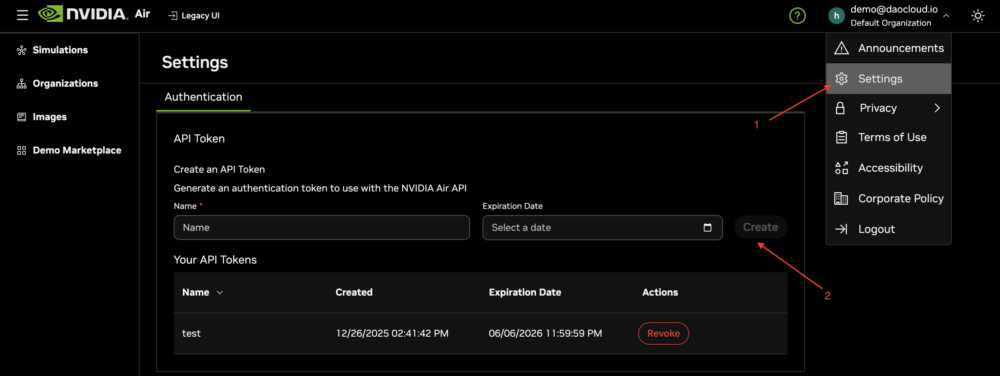
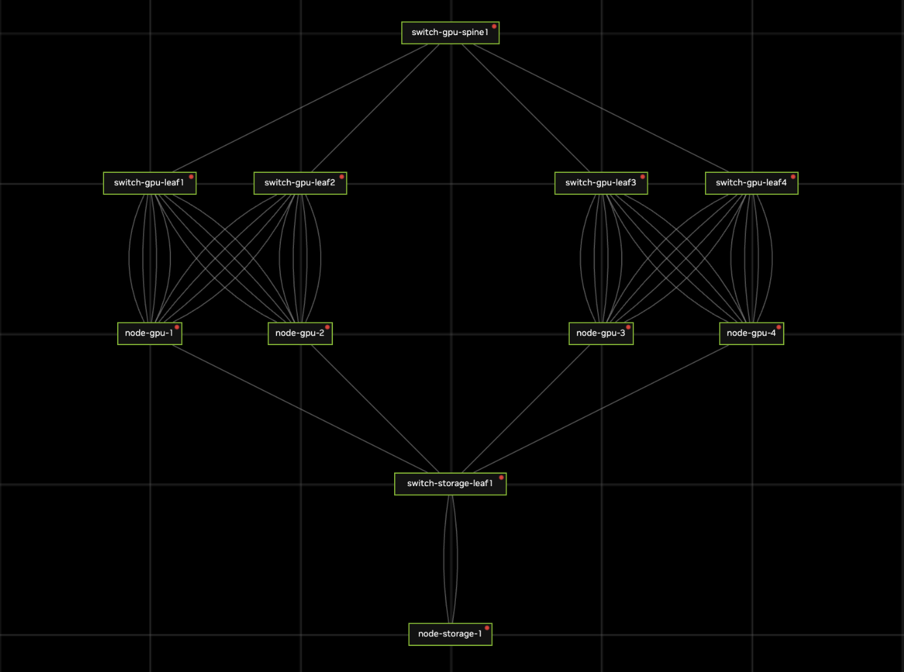

# NVAIR CLI

## Overview

The nvair CLI is a command-line tool that provides access to the [air.nvidia.com](https://air.nvidia.com/) platform for network simulation management. 

Key features:

* **Authentication**: Log in once with automatic credential handling
* **Simulation Management**: Create, delete, and view network simulations
* **Node Discovery**: View nodes within simulations along with their IP addresses
* **Remote Execution**: Execute commands on nodes easily via SSH
* **Port Forwarding**: Manage port forwarding rules more conveniently
* **Rich Examples**: Provide example topologies for AI data center scenarios


## Prerequisites

### Requirements

- Linux, macOS 11+, or Windows 10+
- A valid NVIDIA Air API token (for commands that access your account)

### Create NVIDIA Air API token

1. Go to `https://air.nvidia.com`
2. Click the settings icon in the upper right corner
3. Give your API token a name and set an expiration date
4. Confirm to create the token



## Core Concepts

The following core concepts are used throughout the nvair CLI documentation and design:

- **Simulation**: Simulation is a simulated environment created on the NVIDIA Air platform. It consists of multiple nodes and switches.

- **Node**: Node represents a node in the topology, such as a Linux host or a Cumulus switch.

- **Forward**: A port forwarding rule for a simulation. It maps external ports to internal ports (e.g., Kubernetes API Server and other TCP/UDP workloads).

## Installation

nvair cli binaries are available on our [releases page](https://github.com/unifabric-io/nvair-cli/releases/).

### On Linux

```bash
VERSION=$(curl -s https://api.github.com/repos/unifabric-io/nvair-cli/releases/latest | grep tag_name | cut -d '"' -f4)
[ $(uname -m) = x86_64 ] && \
curl -Lo nvcli.tar.gz https://github.com/unifabric-io/nvair-cli/releases/download/${VERSION}/nvcli_${VERSION}_linux_amd64.tar.gz
[ $(uname -m) = aarch64 ] && \
curl -Lo nvcli.tar.gz https://github.com/unifabric-io/nvair-cli/releases/download/${VERSION}/nvcli_${VERSION}_linux_arm64.tar.gz
tar -xzf nvcli.tar.gz
chmod +x ./nvcli
sudo mv ./nvcli /usr/local/bin/nvcli
```

### On macOS

```bash
VERSION=$(curl -s https://api.github.com/repos/unifabric-io/nvair-cli/releases/latest | grep tag_name | cut -d '"' -f4)
[ $(uname -m) = x86_64 ] && \
curl -Lo nvcli.tar.gz https://github.com/unifabric-io/nvair-cli/releases/download/${VERSION}/nvcli_${VERSION}_darwin_amd64.tar.gz
[ $(uname -m) = arm64 ] && \
curl -Lo nvcli.tar.gz https://github.com/unifabric-io/nvair-cli/releases/download/${VERSION}/nvcli_${VERSION}_darwin_arm64.tar.gz
tar -xzf nvcli.tar.gz
chmod +x ./nvcli
mv ./nvcli /usr/local/bin/nvcli
```

### On Windows (PowerShell)

```powershell
$version = (Invoke-RestMethod https://api.github.com/repos/unifabric-io/nvair-cli/releases/latest).tag_name
curl.exe -Lo nvcli.zip https://github.com/unifabric-io/nvair-cli/releases/download/$version/nvcli_${version}_windows_amd64.zip
Expand-Archive nvcli.zip -Force
Move-Item .\nvcli.exe C:\some-dir-in-your-PATH\nvcli.exe
```

## Usage Examples

The following steps require login, use your NVIDIA Air account and API token see [Prerequisites](#prerequisites).

```log
# Login once
$ nvair login -u <air-username> -p <air-api-token>

# Validate topology config (dry-run)
$ nvair create -d examples/simple/ --dry-run
✓ Topology loaded and validated (dry-run)

# Create simulation 
$ nvair create -d examples/simple/
```

After creation, log in to https://air.nvidia.com/ to see a topology named simple.



> The create command performs the following main steps:
> 1. Load and validate topology configuration from the specified directory
> 2. Create the simulation on NVIDIA Air platform
> 3. Set simulation state to 'load' and wait for initialization jobs
> 4. Configure SSH access through the bastion host
> 5. Reset passwords and apply configurations to switches
>    - This resets the bastion password to `dangerous` and the switch passwords to a known value. It does not affect normal use: password login is not used in practice, and the reset only skips the forced password-change prompt.
> 6. Upload and apply Netplan configurations to Linux nodes
>
> Note: NVIDIA Air automatically provides a bastion (jump) machine in your topology as an additional built-in node for secure access to other nodes.

You can use the following command to view the simulations you created and the nodes within them.

```log
# List simulations
$ nvair get simulation
NAME    STATUS  CREATED              ID                                    SWITCH  HOST
simple  LOADED  2026-04-09 09:02:35  9f6e8ca9-351f-47c7-91a1-6d8d61dd34b4  6       5

# List nodes in a simulation
$ nvair get nodes --simulation simple
NAME                  STATUS   MGMT_IP          IMAGE
switch-gpu-spine1     RUNNING  192.168.200.121  cumulus-vx-5.15.0
switch-storage-leaf1  RUNNING  192.168.200.131  cumulus-vx-5.15.0
switch-gpu-leaf4      RUNNING  192.168.200.114  cumulus-vx-5.15.0
switch-gpu-leaf1      RUNNING  192.168.200.111  cumulus-vx-5.15.0
switch-gpu-leaf2      RUNNING  192.168.200.112  cumulus-vx-5.15.0
switch-gpu-leaf3      RUNNING  192.168.200.113  cumulus-vx-5.15.0
node-gpu-3            RUNNING  192.168.200.8    generic/ubuntu2404
node-gpu-2            RUNNING  192.168.200.7    generic/ubuntu2404
node-gpu-1            RUNNING  192.168.200.6    generic/ubuntu2404
node-gpu-4            RUNNING  192.168.200.9    generic/ubuntu2404
node-storage-1        RUNNING  192.168.200.10   generic/ubuntu2404
```
> If only one simulation is present, you can skip `-s/--simulation`.

We can see the cluster nodes as shown above. When you need to run commands on a specific node, you can use `exec`, as shown below.

```log
# Execute a non-interactive command on a node
$ nvair exec switch-gpu-spine1 -s simple -- hostname
switch-gpu-spine1

# Open an interactive shell on a node
$ nvair exec switch-gpu-spine1 -s simple -it
cumulus@switch-gpu-spine1:mgmt:~$ pwd
/home/cumulus
```

When you need to expose internal UI components of the cluster externally, directly access cluster nodes via the public port 22, or expose any service for external access via a public port, you can use the `forward` command.

```log
# The example maps port 6443 on gpu-node-1 to an externally accessible address (worker04.air.nvidia.com:22978).
$ nvair add forward --target-host gpu-node-1 --target-port 6443
✓ Forward service created successfully.
    worker04.air.nvidia.com:22978 -> gpu-node-1:6443

# List port forward rules in a simulation
$ nvair get forward
Using simulation "simple" by default. Use -s/--simulation <name> to specify a different simulation.
NAME                          EXTERNAL                       DESTINATION
forward->gpu-node-1:6443      worker04.air.nvidia.com:21676  gpu-node-1:6443
forward->oob-mgmt-server:22   worker04.air.nvidia.com:27176  oob-mgmt-server:22
```
> The source port `22978` is randomly assigned by the NVIDIA Air platform and cannot be specified.


## Verbose Mode

Enable verbose logging with the `--verbose` or `-v` global flag to get detailed information for debugging:

```bash
# Login with verbose output
nvair --verbose login -u user@example.com -p <api-token>

# Example verbose output shows:
# [DEBUG] [2026-02-10 10:23:45] Verbose mode enabled
# [DEBUG] [2026-02-10 10:23:45] Login command started with username: user@example.com
# [DEBUG] [2026-02-10 10:23:45] Flags validated successfully
# [DEBUG] [2026-02-10 10:23:45] Step 1/6: Authenticating with API endpoint: https://air.nvidia.com/api
# [DEBUG] [2026-02-10 10:23:45] doRequest: [Attempt 1/3] POST https://air.nvidia.com/api/v1/login/
# [DEBUG] [2026-02-10 10:23:45] doRequest: Request body: {"username":"user@example.com","password":"..."}
# ...
```

Verbose mode logs are printed to stderr and include timestamps. This is especially useful for:
- Debugging authentication failures
- Troubleshooting network connectivity issues
- Understanding SSH key generation process
- Inspecting API request/response details
- Analyzing retry behavior on transient failures

## Next Steps

- For example topologies and usage samples, see the [examples directory](./examples/) and [examples guide](./examples/README.md).
- For developer-focused setup, including build, tests, and CI, see the [development guide](./docs/development/development.md).
- For API details and the data model, see the [API contract](./docs/design/contracts/api.md) and [data model](./docs/design/data-model.md).
