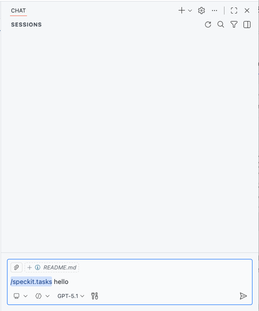

# Developer's guide with spec-kit

## Requirements

- **Linux/macOS 11+/Windows 10+**
- [Supported](https://github.com/github/spec-kit?tab=readme-ov-file#-supported-ai-agents) AI coding agent.
- [Git](https://git-scm.com/downloads)

## Setup

### Visual Studio Code

If you use VS Code, add the following file `.vscode/settings.json` to your project root:

```json
{
    "chat.promptFilesRecommendations": {
        "speckit.constitution": true,
        "speckit.specify": true,
        "speckit.plan": true,
        "speckit.tasks": true,
        "speckit.implement": true
    },
    "chat.tools.terminal.autoApprove": {
        ".specify/scripts/bash/": true,
        ".specify/scripts/powershell/": true
    }
}
```

Then launch your AI assistant in the project directory. The `/speckit.*` commands are available in the assistant.

Spec-kit is a set of prompt files in `.github/prompts`. This project is already set up with `specify init`, so no extra tools are needed.


### Other

If you are using a different editor or AI assistant, you can download the required files from [spec-kit/releases](https://github.com/github/spec-kit/releases) and add them to your project.

For more read the [spec-kit](https://github.com/github/spec-kit) documentation to set it up.

## Quickly develop a new feature

This guide explains how to quickly develop a new feature in this project using the spec-kit toolchain.



### 1. Create a Feature Spec and Branch

From the project root, use the speckit command:

```bash
# Example: develop a "user login" feature
/speckit.specify "Add user login feature"
```

This will automatically:
- Create a new branch (e.g., 002-user-login)
- Generate a spec template (specs/002-user-login/spec.md)
- Initialize a requirements checklist

### 2. Clarify Requirements

If you see any [NEEDS CLARIFICATION] markers, use speckit.clarify to resolve them interactively:

```bash
/speckit.clarify
```
Follow the prompts to make decisions until the checklist passes.

### 3. Move to Planning

Once requirements are clear, continue with:

```bash
/speckit.plan
```
This generates a development task breakdown, priorities, and delivery criteria.

### 4. Implementation and Delivery

Work through the speckit-generated task list. When done, you can:

```bash
/speckit.implement
```
This will auto-generate a PR, sync checklists, and track progress.

### 5. Best Practices

- All new features should be spec-driven: write the spec before implementation
- The full flow—requirements, clarification, planning, development, acceptance—is traceable
- Specs, code, tests, and use cases should correspond one-to-one

See the README or speckit help for more advanced usage.


## PR Workflow Summary

- **Trigger**: Pull Request to `main`

- **Jobs (run in parallel)**:
  - **unit-tests**: format check, build CLI, unit tests, coverage ≥ 85%, upload to Codecov
  - **integration-tests**: build CLI, mock integration tests (required), real API tests (optional)
  - **security**: Gosec scan, upload security report

- **One-time setup**:
  - Set `NV_AIR_USER` and `NV_AIR_TOKEN` in GitHub Actions secrets


## Test Commands Quick Reference

- **Unit Tests**  
  `make test-unit`

- **Coverage Tests**  
  `make test-coverage` (generates `coverage.html`)

- **E2E Tests**  
  `NV_AIR_USER=changeme@xx.com NV_AIR_TOKEN=changeme make test-e2e`
