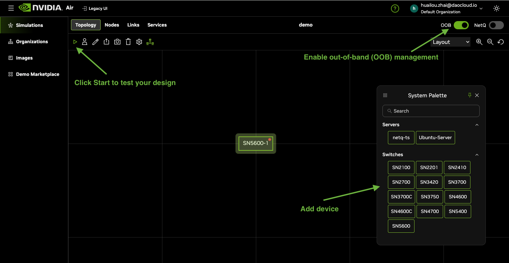
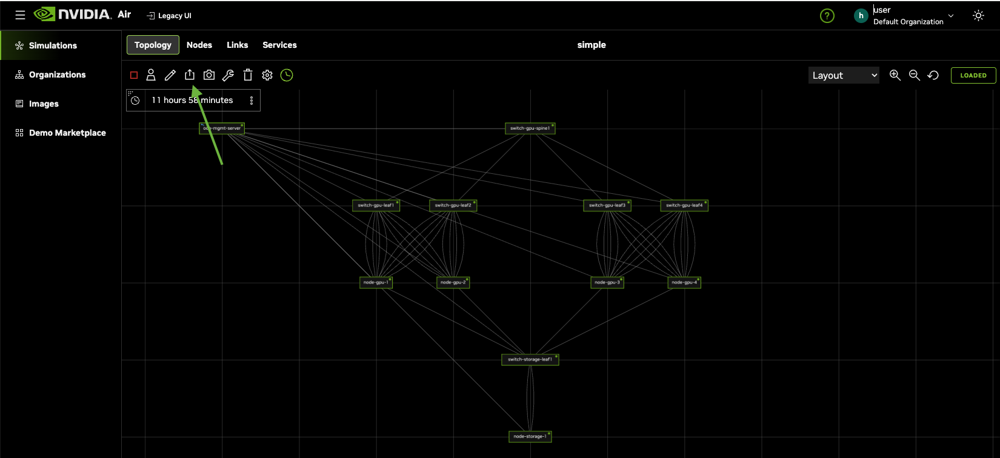

# Custom Topology Simulation

## Overview

Use this guide to build a custom NVIDIA Air simulation.

### 1. Design the topology

Sign in to [air.nvidia.com](https://air.nvidia.com/), click **Create Simulation**, and design the topology.



### 2. Export the topology

Click the **Export topology** button.   


### 3. Linux node Netplan configuration

Each node must provide a data-plane interface configuration file whose name follows the format `<node-name>.yaml`, containing standard Netplan configuration.

**Example: node-gpu-1.yaml**

```yaml
network:
  version: 2
  renderer: networkd
  ethernets:
    eth1:
      addresses:
        - "172.17.1.11/24"
      mtu: 4200
      routes:
        - to: 0.0.0.0/0
          via: 172.17.1.1
          table: 101
      routing-policy:
        - from: 172.17.1.11
          table: 101
          priority: 31761
    # ... additional interfaces
```

> Netplan defines Linux network configuration. See the [Netplan wiki](https://wiki.debian.org/Netplan) for details.

### 4. Switch configuration

Export NVUE configuration from each switch: `nv config show -o yaml > <switch-name>.yaml`.

**Example: switch-gpu-leaf1.yaml**

```yaml
- header:
    model: vx
    nvue-api-version: nvue_v1
    rev-id: 1.0
    version: Cumulus Linux 5.15.0
- set:
    bridge:
      domain:
        br_default:
          untagged: 1
          vlan:
            10,20,30,40: {}
    interface:
      eth0:
        ipv4:
          dhcp-client:
            set-hostname: enabled
            state: enabled
        type: eth
        vrf: mgmt
      swp2,6:
        bridge:
          domain:
            br_default:
              access: 10
      vlan10:
        ipv4:
          address:
            172.17.1.1/24: {}
        type: svi
        vlan: 10
```

### Validate Files and Run Test

Make sure your files meet the requirements described above. Then run `nvair create -d . --dry-run` to validate the configuration. If there are no issues, run `nvair create -v -d .` to create the test simulation.

#### Example Directory Listing

```bash
$ ls -1
topology.json
node-gpu-1.yaml
node-gpu-2.yaml
node-gpu-3.yaml
node-gpu-4.yaml
node-storage-1.yaml
switch-gpu-leaf1.yaml
switch-gpu-leaf2.yaml
switch-gpu-leaf3.yaml
switch-gpu-leaf4.yaml
switch-gpu-spine1.yaml
switch-storage-leaf1.yaml
```

#### Requirements

A simulation folder should contain:

| File Format | Description | File Count |
| ----------- | ----------- | ---------- |
| `topology.json`           | NVIDIA Air simulation topology        | Only one     |
| `<linux-node-name>.yaml`  | Netplan configuration for Linux nodes | 1 per node   |
| `<switch-node-name>.yaml` | Switch configuration                  | 1 per switch |

## Contributing

We welcome new custom simulation examples. Add your example under the `examples/` directory and open a pull request so we can grow the documentation and sample set together.
